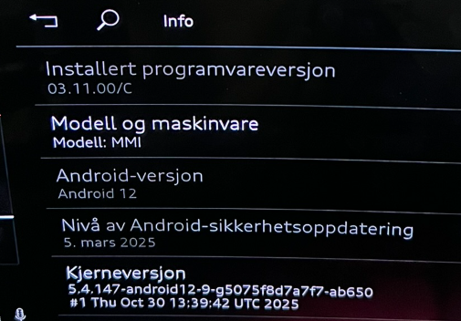
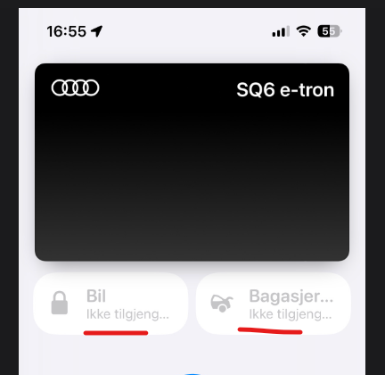
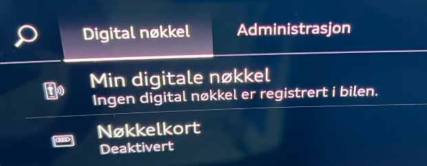
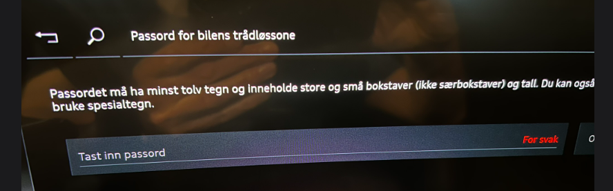
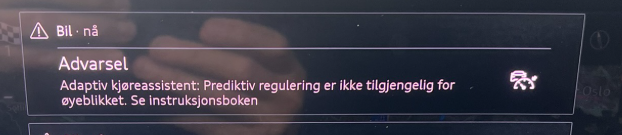
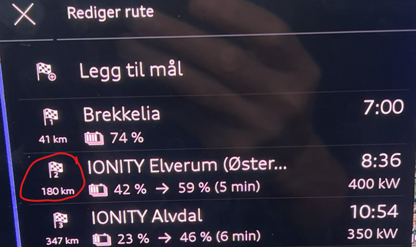
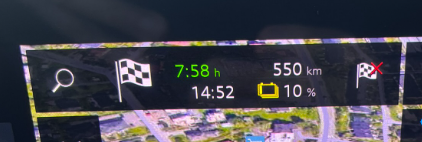

## KD2* - 03.11.00/C (Action de service 06K2)

- Il ne s'agit pas d'une mise à jour en OTA; la voiture doit être mise à jour lors d'un atelier/dealership
- Le travail devrait prendre 3,5 heures

### Ce qui a été fixé ou amélioré
- Un certain nombre de problèmes et un comportement de hayon incohérent après l'installation de KD2 auraient été corrigés, en particulier pour ceux qui utilisent la clé numérique. Jusqu'à présent, il est encore trop tôt pour en tirer des conclusions, car la voiture se comporte parfois sans faille pendant des semaines ou même des mois.
- Les systèmes d'assistance au conducteur seraient améliorés
- Le son d'avertissement a été changé, passant d'un bip un peu ennuyeux et aiguisé à un son beaucoup plus agréable. Cela semble avoir été mis à jour sur tous les sons du système, sauf pour l'avertissement de stationnement, où le ou les sons sont inchangés. Et c'est parfaitement bien.
- On dit que plusieurs problèmes de queue sont résolus. [Known issue #94](https://github.com/electrichasgoneaudi/q6-e-tron/issues/94)

- Beaucoup d'autres corrections sont demandées, et cette liste sera mise à jour lorsque de plus amples informations seront disponibles.

### Lorsque vous recevez la voiture après la mise à jour a été faite
- L'ouvre-porte de garage doit être programmée à nouveau
- Le mot de passe Wi-Fi peut être à nouveau défini, alors vérifiez ceci
- La vue de navigation dans Head UP Display était désactivée et devait être réactivée.

### Ce qui n'a pas été fixé
- Le calcul de SoC pour le prochain arrêt ou le dernier arrêt de navigation est encore assez inexact. [Known issue #97](https://github.com/electrichasgoneaudi/q6-e-tron/issues/97)
- Les messages d'erreur de charge intelligents n'ont pas été corrigés; il signale toujours les erreurs réseau de charge lors de la mise en pause du charge par le robot de charge. [Known issue #16](https://github.com/electrichasgoneaudi/q6-e-tron/issues/16)
- Les abandons de Wi-Fi se produisent de temps à autre.
[Known issue #4](https://github.com/electrichasgoneaudi/q6-e-tron/issues/4) et
[Known issue #90](https://github.com/electrichasgoneaudi/q6-e-tron/issues/90)
- Le problème de l'ouverture de porte de garage n'a pas été corrigé. [Known issue #67](https://github.com/electrichasgoneaudi/q6-e-tron/issues/67)
L'état de l'application se réinitialise à intervalles irréguliers. [Known issue #109](https://github.com/electrichasgoneaudi/q6-e-tron/issues/109)

### Expériences après la mise à jour
- L'avertissement à grande vitesse est maintenant si agréable, tout en étant audible, que vous pouvez en fait simplement laisser. Dans les cas où vous vous oubliez et vous accélèrez dans une nouvelle zone de limite de vitesse, vous obtenez un léger rappel à ce sujet.
- Le centreage actif de la voie semble placer la voiture plus au milieu de la voie, par rapport à un peu trop loin à gauche dans les versions précédentes, et la voiture est maintenue assez stable sans tissage
- La clé numérique n'a travaillé qu'avec la NFC et non avec l'UBB/BLE (Bluetooth), ce qui s'est résolu et a fonctionné depuis le 2e jour.
J'ai compris, ce qui a clairement montré que le téléphone n'était pas en mesure de trouver la voiture.
 

Cela s'est résolu et a fonctionné depuis le 2e jour.
- Vérifiez le mot de passe Wi-Fi dans la voiture. Vous devrez peut-être en créer un nouveau. 
- Il y a encore de nombreuses occasions de message d'erreur célèbre qui ne contrôle pas le contrôle prédictif. Il s'est produit environ 20 fois lors d'un voyage d'Oslo à Trondheim. Est une amélioration par rapport au dernier voyage quand j'ai obtenu environ 50 de ces messages, et heureusement maintenant le signal sonore n'est pas si ennuyeux. Mais il est complètement inutile d'avoir un avertissement audio. Ce n'est pas une erreur grave et vous ne pouvez rien faire à ce sujet, donc cet avertissement devrait être aussi subtil que possible et complètement sans un signal d'avertissement.

- La gêne que la navigation a connue n'a pas été améliorée non plus. (#2) et (#3) avec un nombre dans la rangée,
 Mais l'écran de navigation choisit de montrer des informations sur le dernier point d'arrêt. Il n'est pas particulièrement intéressant à ce stade du voyage (après #1 a été passé), ce qui est le plus utile ici est des informations sur le prochain arrêt (#2)Quoi qu'il arrive. 
