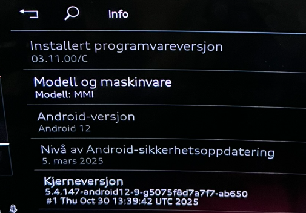
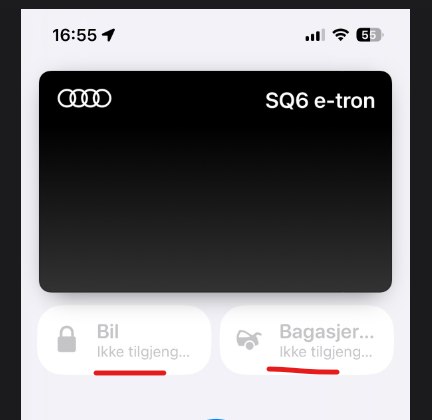
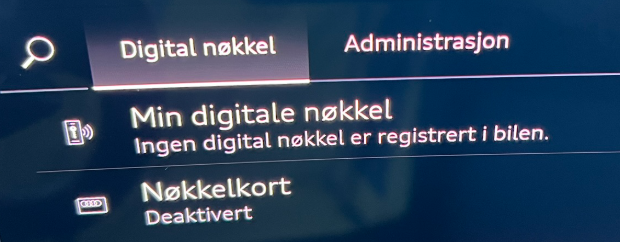
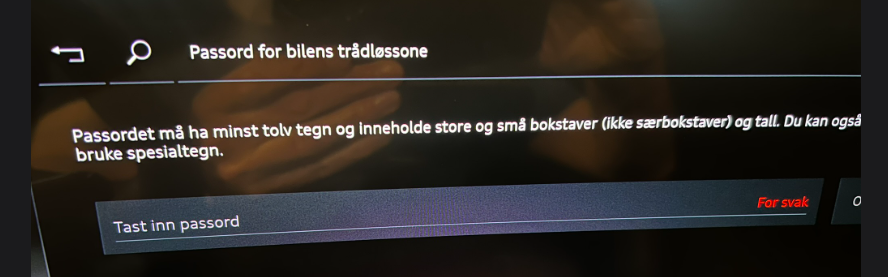
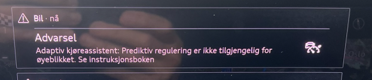

## KD2* - 03.11.00/C

- This is NOT an OTA update; the car must be updated at a workshop/dealership
- The job is expected to take 3.5 hours

### What has been fixed or improved
- A number of issues and inconsistent tailgate behavior after KD2 was installed are said to have been fixed, especially for those using the Digital Key. So far, it is still too early to draw conclusions on this, as the car sometimes behaves flawlessly for weeks or even months
- The driver assistance systems are said to be improved
- The warning sound has been changed from the somewhat annoying and sharp beep to a much more pleasant sound. This appears to have been updated across all system sounds, except for the parking warning, where the sound(s) are unchanged. And that is perfectly fine.
- Various tailgate issues are said to be resolved. [Known issue #94](https://github.com/electrichasgoneaudi/q6-e-tron/issues/94)

- Many more fixes are claimed, and this list will be updated when more information becomes available.

### When you receive the car after the update has been done
- The garage door opener must be programmed again
- The Wi-Fi password may need to be set again, so check this

### What has not been fixed
- The calculation of SoC for the next stop or the final stop in navigation is still quite inaccurate. [Known issue #97](https://github.com/electrichasgoneaudi/q6-e-tron/issues/97)
- Smart charging error messages have not been fixed; it still reports charger network errors when charging is paused by the charging robot. [Known issue #16](https://github.com/electrichasgoneaudi/q6-e-tron/issues/16)
- Wi-Fi dropouts still occur from time to time.  
[Known issue #4](https://github.com/electrichasgoneaudi/q6-e-tron/issues/4) and  
[Known issue #90](https://github.com/electrichasgoneaudi/q6-e-tron/issues/90)
- The garage door opener issue has not been fixed. [Known issue #67](https://github.com/electrichasgoneaudi/q6-e-tron/issues/67)
App state resets at irregular intervals. [Known issue #109](https://github.com/electrichasgoneaudi/q6-e-tron/issues/109)

### Experiences after the update
- The high-speed warning is now so pleasant, while still audible, that you can actually just leave it on. In cases where you forget yourself and speed into a new speed limit zone, you get a gentle reminder about it. This is, however, very much a matter of personal preference.
- Active lane centering appears to place the car more in the middle of the lane, compared with somewhat too far to the left in earlier versions, and the car is kept quite stable without any weaving
- The Digital Key only worked with NFC and not UWB/BLE (Bluetooth). This resolved itself and has worked since day 2.  
Check your app. I got this, which clearly showed that the phone was unable to find the car.  

This resolved itself and has worked since day 2.
- Check the Wi-Fi password in the car. You may need to create a new one. 
- There are still many instances of the famous error message that Predictive control is not available. Happened about 20 times on a trip from Oslo to Trondheim. Is an improvement from the last trip when I got about 50 of these messages, and now fortunately the sound signal is not so annoying. But it is completely unnecessary to have an audio warning. This is not a serious error and you can't do anything about it, so this warning should be as subtle as possible and completely without a warning sound.

