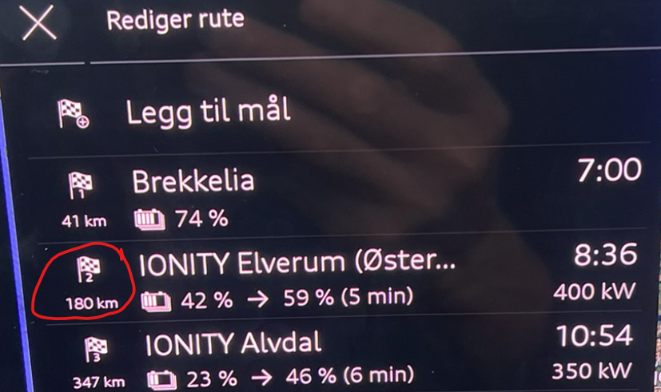
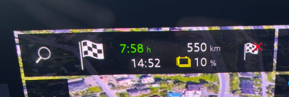

## KD2* - 03.11.00/C

- Dette er IKKE en OTA oppdatering, bilen må oppdateres på verksted
- Jobben er antatt å ta 3,5 timer

### Hva er rettet eller forbedret
- En rekke feil og inkonsistent oppførsel for bakluke etter at KD2 ble lagt inn skal være rettet, og dette spesielt for den som utnytter Digital Nøkkel. Så langt er det tidlig å konkludere noe på dette, da bilen noen ganger oppfører seg prikkfritt i både uker og måneder
- Kjøreassistent systemene skal være forbedret.
- Varsellyd er endret fra den litt irriterende og skarpe pipelyden til en mye mer behagelig lyd. Dette virker å være oppdatert på alle systemlyder, unnatt parkeingsvarsling, den/de lydene er uendret. Og det er bare fint.
- Diverste bakluke problemer skal være løst. [Known issue #94](https://github.com/electrichasgoneaudi/q6-e-tron/issues/94)

- Påstås mange flere fikser, og lista vil bli oppdatert når mer informasjon foreligger.

### Når du mottar bilen etter at oppdateriger er gjodt
- Garasjeportåpner må programmeres på nytt
- Passord for Wifi må kanskje settes på nytt, så sjekk dette
- Navigasjonsvisniong i Head UP Display var slått av og måtte aktiveres på nytt

### Hva er ikke rettet
- Kalkulasjon av SoC for neste stopp eller siste stopp i navigasjon er fremdeles ganske feil. [Known issue #97](https://github.com/electrichasgoneaudi/q6-e-tron/issues/97)
- Smartlading, feilmeldinger er ikke rettet, får fremdeles feil på ladenettverk når lading pauses av laderobot. [Known issue #16](https://github.com/electrichasgoneaudi/q6-e-tron/issues/16)
- Bortfall av Wifi forekommer fremdeles ved jevne mellomrom. 
[Known issue #4](https://github.com/electrichasgoneaudi/q6-e-tron/issues/4) og 
[Known issue #90](https://github.com/electrichasgoneaudi/q6-e-tron/issues/90)
- Garasjeportåpner problem ikke rettet. [Known issue #67](https://github.com/electrichasgoneaudi/q6-e-tron/issues/67)
- App tilstand nullstilles ved ujevne mellomrom. [Known issue #109](https://github.com/electrichasgoneaudi/q6-e-tron/issues/109)

### Erfaringer etter oppdatering
- Varsel for høy hastighet er nå så behagelig, men fremdeles hørbar, at man kan faktisk bare la den stå på, i de tilfellene man glemmer seg av og suser inn i en ny fartsgrensesone, så får du en behagelig påminnelse om dette. Dette er dog veldig individuelt preferansestyrt.
- Aktiv kjørefeltsføring ser ut til å plassere bilen mer midt i kjørefeltet, mot litt mye til venstre i tidligere utgaver, og bilen holdes ganske stabilt uten noe vingling
- Digital nøkkel fungerte bare på NFC og ikke UWB/BLE (Bluetooth). Dette gikk over og har fungert fra dag 2. 
Sjekk appen din. Jeg fikk dette som viser at telefonen åpenbart ikke klarte å finne bilen.

Dette gikk over og har fungert fra dag 2. 
- Sjekk Wifi passordet i bilen. Det kan være du må lage nytt. 
- Det kommer fremdeles mange forekomster av den berømte feilmeldingen om at Prediktiv regulering ikke er tilgjengelig. Skjedde ca 20 ganger på en tur fra Oslo til Trondheim. Er jo en forbedring fra forrige tur da jeg fikk ca 50 av disse meldingene, og nå er heldigvis lydsignalet ikke så plagsomt. Men det er jo helt unødvendig å ha lydvarsling. Dette er ikke en alvorlig feil og man kan ikke gjøre noe med det, så dette varselet bør være så subtilt som mulig og helt uten varsellyd.

- Den kjente irritasjonsmomentet fra navigasjonen, er heller ikke forbedret noe. Her er det en planlagt ladestopp (#2) og (#3) med et nummer i rekken, 

Men navigasjonsbildet velger å vise informasjon om siste stoppunkt. Det er ikke spesielt interessant på denne fasen i turen (Etter at #1 er passert), det som er mest nyttig her er informasjon om neste stopp (#2), uansett årsak. 
