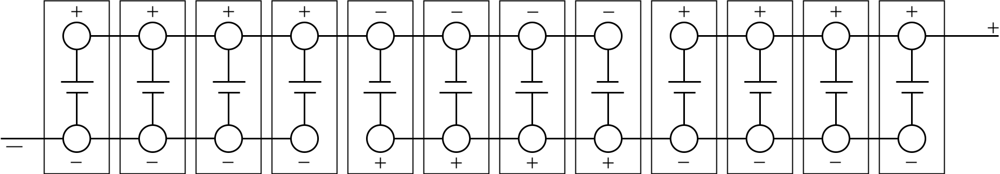

<!-- markdownlint-disable MD033 -->

## Technologie cellulaire

Audi/Volkswagen a une stratégie multi-vendeur sur les cellules. Cela signifie qu'Audi utilise différents fournisseurs de cellules Lithium-ion pour différentes batteries.

## Piles

### Batterie de 114kWh

La batterie du Audi SQ8 e-tron et du Audi Q8 e-tron a une capacité brute de 114kWh (106kWh net) et une tension nominale de 396 volts. Elle se compose de 36 modules avec 12 cellules chacun, ce qui donne un total de 432. Les cellules de chaque module sont connectées dans une configuration 4p3s.

Comme chaque cellule est sur 72a, chaque groupe parallèle donne une capacité de 288ah. (4 x 72a)

Lorsque 36 modules de ce type sont connectés en série, la tension nominale est de 396 volts.

396 volts * 288ah = 114 048 Watt-heure (Wh) ou 114kWh (kilowatt-heures)

Chaque module est sur 11 Volts et a une capacité de 288 x 11 = 3168 Wh ou 3.168 kWh.

Chaque module pèse environ 13 kg.

<figure>
    
    <figcaption><h4>Module avec nouvelles cellules 72AH</h4></figcaption>
</figure>

Poids total de la batterie est de 1605lb (728 kg)

### Batterie de 95kWh

La batterie du Audi Q8 50 e-tron a une capacité brute de 95kWh (filet 89kWh) et une tension nominale de 396 volts. Elle se compose de 36 modules avec 12 cellules chacun, ce qui donne un total de 432. Les cellules de chaque module sont connectées dans une configuration 4p3s.

Comme chaque cellule est sur 60a, chaque groupe parallèle donne une capacité de 240ah. (4 x 60a)

Lorsque 36 modules de ce type sont connectés en série, la tension nominale est de 396 volts.

396 volt * 240ah = 95 040 Watt-heure (Wh) ou 95kWh (kilo Watt Heures)

Chaque module est sur 11 Volts et a une capacité de 240 x 11 = 2640 Wh ou 2,64 kWh.

Chaque module pèse environ 13 kg.

Le poids total de la batterie est de 1532,2lb (699,99 kg)

## Boîtier de batterie

La plupart des pièces de la batterie sont réutilisées avec la plus grande batterie 95kWh. La 95kWh utilise un deuxième étage sous les sièges arrière pour obtenir la pièce nécessaire pour les 36 modules.

<figure>
    
    <figcaption><h4>Batterie de 114kWh avec 36 modules, dont cinq au deuxième étage</h4></figcaption>
</figure>

<figure>
    
    <figcaption><h4>Batterie de 114kWh avec 36 modules, dont cinq au deuxième étage</h4></figcaption>
</figure>

Des mesures sophistiquées ont été prises pour protéger la batterie haute tension de l'Audi e-. Un cadre solide encastrant des nœuds en aluminium moulé et des sections extrudées, ainsi qu'une plaque en aluminium 3,5 millimètres (0,1 po) d'épaisseur protègent contre les dommages causés par les accidents ou les bordures. À l'intérieur, une structure en aluminium de type framework renforce le système de batterie.

<figure>
    
    <figcaption><h4>Structure intégrée de la batterie lithium-ion</h4></figcaption>
</figure>

Le boîtier, avec ses structures de choc sophistiquées comprenant 47 pour cent de sections en aluminium extrudé, 36 pour cent de tôle d'aluminium et 17 pour cent de pièces en aluminium moulé sous pression, pèse environ 700 kilogrammes (1 543,2 lb). Il est boulonné à la structure de la caisse du Audi e-tron à 35 points. Cela augmente sa rigidité torsionnelle de 27 pour cent et contribue au niveau élevé de sécurité du Audi e-tron, tout comme le système de refroidissement lié à l'extérieur du boîtier de la batterie.

## Gestion thermique

Les batteries sont créées pour donner des performances élevées sur une large gamme de niveaux de température et de charge.

Un système de refroidissement de sections extrudées en aluminium plat divisées uniformément en petites chambres a pour tâche de maintenir la batterie à haute performance sur le long terme.

 La chaleur est échangée entre les cellules et le système de refroidissement sous elles via un gel conducteur thermiquement pressé sous chaque module cellulaire. Dans une solution particulièrement efficace, le gel transfère uniformément la chaleur résiduelle au liquide de refroidissement via le boîtier de la batterie.

<figure>
    
    <figcaption><h4>Refroidissement de la batterie lithium-ion par le refroidisseur</h4></figcaption>
</figure>

La batterie et tous ses paramètres, tels que l'état de charge, la puissance et la gestion thermique, sont gérés par le contrôleur externe de gestion de batterie (BMC). Il est situé dans la cellule occupante sur la bonne colonne A du Audi e-tron. Le BMC communique à la fois avec les unités de commande des moteurs électriques et les contrôleurs de module cellulaire (CMC), chacun d'eux surveille le courant, la tension et la température des modules.

<figure>
    
    <figcaption><h4>Boîte de jonction de batterie</h4></figcaption>
</figure>

La boîte de jonction de batterie (BJB), dans laquelle les relais et fusibles haute tension sont intégrés, est l'interface électrique du véhicule. Enfermée dans un boîtier en aluminium moulé sous pression, elle est située dans la section avant du système de batterie. L'échange de données entre le BMC, les CMC et le BJB se fait par un système d'autobus séparé.



## Exécution de la charge

Audi e-tron a été leader sur le marché en vitesse de charge moyenne depuis son introduction. Alors, comment cela se compare-t-il au lifting ? [EVKX.net](https://evkx.net), electrichasgoneaudi.net ci-dessous la courbe de charge pour le Audi Q8 50 e-tron (même que le Audi e-tron 55) et le Audi Q8 e-tron 55 avec la nouvelle batterie.

|Variante | Consommation 120km/h | Arrêts de chargement | Durée totale | Enregistrer |
|-------|-------------|-------|------|-----|
|[Audi Q8 50 e-tron](../../models/q8-e-tron/variants/#audi-q8-50-e-tron)                    | 26 kWh/100km       | 3 x (15 %-80 %)   |9h:49m  | -43m  |
|[Audi Q8 50 Sportback e-tron](../../models/q8-e-tron/variants/#audi-q8-50-sportback-e-tron)| 24,5 kWh/100km     | 2 x (5%-80%)    |9h33m  | -49m  |
|[Audi Q8 55 e-tron](../../models/q8-e-tron/variants/#audi-q8-55-e-tron)                    | 26 kWh/100km       | 2 x (1 %-74 %)    |9h36m  | -21m  |
|[Audi Q8 55 Sportback e-tron](../../models/q8-e-tron/variants/#audi-q8-55-sportback-e-tron)| 24,5 kWh/100km     | 2 x (3 %-81 %)    |9h32m  | -18 millions  |
|[Audi SQ8 e-tron](../../models/q8-e-tron/variants/#audi-sq8-e-tron)                        | 28 kWh/100km       | 3 x (16%-71%)   |9h46m  | -21m  |
|[Audi SQ8 e-tron Sportback](../../models/q8-e-tron/variants/#audi-sq8-sportback-e-tron)    | 26 kWh/100km       | 2 x (1 %-74 %)    |9h36m  | - 24 m  |

Comme le montre le tableau, la batterie de 95kWh est encore comparable à la nouvelle batterie et bat même la batterie plus grande en raison d'une courbe plus flattée pour cette distance.


