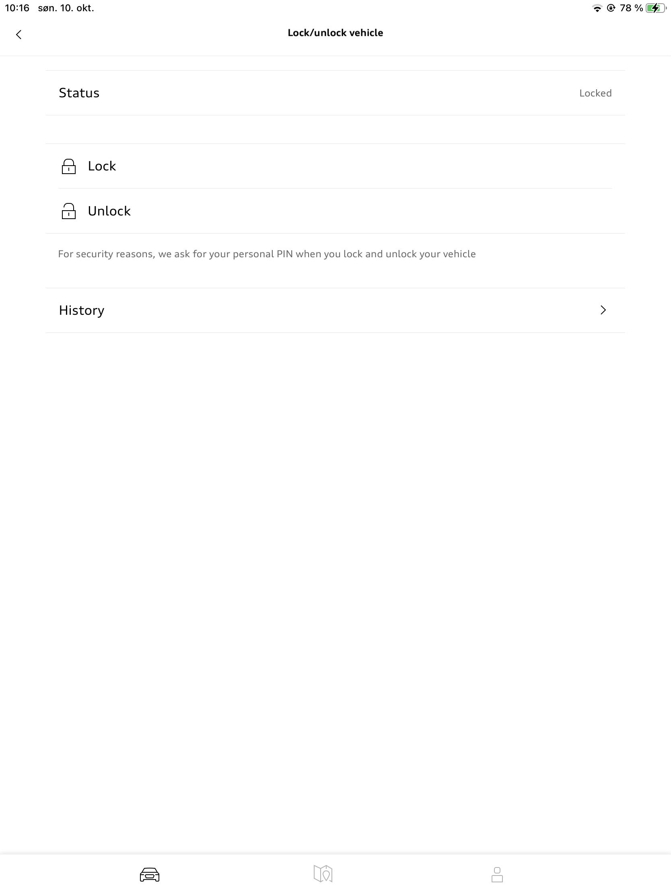

## Audi service term online

Audi service term online informerer kundens valgte Audi-verksted når det er tid for service. Verkstedet kan da kontakte kunden for å avtale tid.

## Bilstatusrapport

Takket være bilstatusrapporten for Audi e-tron i Audi connect kan du se mye informasjon på smarttelefonen din via myAudi-appen. Audi connects bilstatusrapport inneholder blant annet følgende informasjon:

- Batteriladenivå
- Status på ladepluggen

## Fjernkontroll for låsing/opplåsing

Bilen kan enkelt låses og låses opp ved hjelp av smarttelefonen via myAudi-appen

## Parkeringsposisjon

Bilens parkeringsposisjon vises på kartet i myAudi-appen på smarttelefonen.

## Varsling fra tyverialarm

Push-meldinger via myAudi-appen hvis innbruddsalarmen (valgfritt) utløses.

## Fjernkontroll for lading

Du kan planlegge lade- og programmeringstider via myAudi-appen. Dette beskytter bilbatteriet.

## Fjernkontroll av klimakontroll

e-trons parkeringsklimaanlegg kan styres med myAudi-appen.

## Kjøredata

Få oversikt over strømforbruk, kjøretid og kjørelengde

{}
