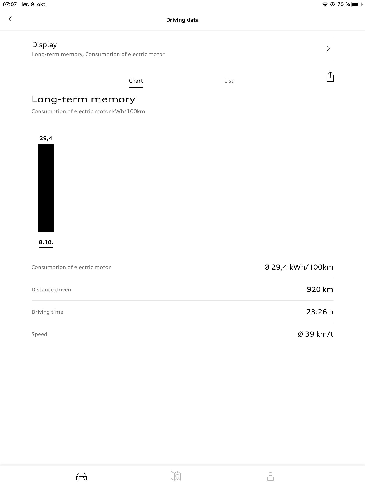

The following screenshots show some of the capabilities the myAudi app have. Screenshots from the IOS app (Ipad).

### Manage all cars

You can manage all your Audis in the same app

### Car status

You get the current car status.

### Functionality

### Charging target

You can change the charging target for the car. To preserve the battery
the most you should only charge to 100% when you need to.

### Climate control

{}
