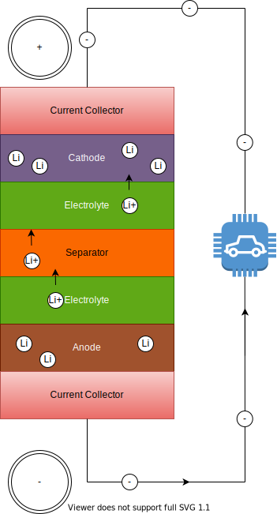

<!-- markdownlint-disable MD033 -->
Eine Lithium-Ionen-Batterie besteht aus zwei Elektroden (Anode & Kathode), Separator, Elektrolyt und zwei Stromabnehmern (positiv und negativ).

Bei der Entladung bewirkt eine elektrochemische Reaktion in Anode, dass sie positive Lithiumionen in den Elektrolyten abgibt, der die positiv geladenen Lithiumionen von der Anode zur Kathode transportiert.

Diese Reaktion in Anode wird Reduktion genannt und die Anode wird als Reduktionsmittel bezeichnet, weil sie Lithiumatome verliert.

Die Kathode ist als Oxidationsmittel bekannt, weil sie Lithiumionen von der Anode akzeptiert.

Wenn die Anode positive Lithiumionen freisetzt, befreit sie gleichzeitig Elektronen von den Lithiumatomen der Elektrode.

Diese freien Elektronen versammeln sich innerhalb der Anode, wodurch die beiden Elektroden unterschiedliche Ladungen haben:

Die Anode wird negativ geladen, wenn Elektronen freigesetzt werden, und die Kathode wird positiv geladen, wenn positive Lithiumionen verbraucht werden.

Diese unterschiedliche Ladung bewirkt, dass sich die Elektronen in Richtung der positiv geladenen Kathode bewegen wollen. Sie haben jedoch keine Möglichkeit, in die Batterie zu gelangen, weil der Separator sie daran hindert. Die Ladung wird in Volt gemessen und hängt von der verwendeten Chemie ab. Eine typische Lithium-Ionen-Zelle hat eine Ladung zwischen 3,6 und 4,2 Volt, abhängig vom Ladezustand (SOC).

In einem EV können wir den Wunsch nutzen, dass die Elektronen sich wieder mit den positiven Lithiumionen in der Kathode vereinen. Wenn wir einen externen Stromkreis durch einen Elektromotor oder eine andere elektronische Komponente erzeugen, können wir den Fluss der Elektronen den Motor antreiben.

Die Stromabnehmer arbeiten als elektrischer Leiter zwischen der Elektrode und externen Stromkreisen.


