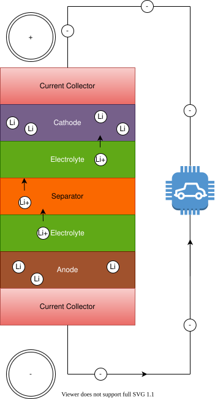

<!-- markdownlint-disable MD033 -->
Une batterie Lithium-ion est composée de deux électrodes (anode et cathode), séparateur, électrolyte et deux collecteurs de courant (positifs et négatifs).

Lors de la décharge, une réaction électrochimique dans l'anode lui fait libérer des ions lithium positifs dans l'électrolyte. L'électrolyte transporte les ions lithium chargés positivement de l'anode à la cathode.

Cette réaction dans l'anode est appelée réduction et l'anode est connue comme l'agent réducteur parce qu'elle perd des atomes de lithium.

La cathode est connue comme l'agent oxydant parce qu'elle accepte les ions lithium de l'anode.

Lorsque l'anode libère des ions lithium positifs, il libère en même temps les électrons des atomes de lithium de l'électrode.

Ces électrons libres se rassemblent à l'intérieur de l'anode. Ainsi, les deux électrodes ont des charges différentes:

L'anode devient chargée négativement à mesure que les électrons sont libérés, et la cathode devient chargée positivement à mesure que les ions lithium positifs sont consommés.

Cette différence de charge fait que les électrons veulent se diriger vers la cathode chargée positivement. Cependant, ils n'ont pas le moyen d'y arriver à l'intérieur de la batterie parce que le séparateur les empêche de le faire. La charge est mesurée en volt et dépend de la chimie utilisée. Une cellule Lithium-ion typique a une charge entre 3,6 et 4,2 volts selon l'état de charge (SOC).

Dans un EV, nous pouvons profiter de cette volonté pour que les électrons se réunissent avec les ions lithium positifs dans la cathode. Si nous créons un circuit externe à travers un moteur électrique ou un autre composant électronique, nous pouvons le flux des électrons conduire le moteur.

Les collecteurs de courant fonctionnent comme un conducteur électrique entre l'électrode et les circuits externes.


