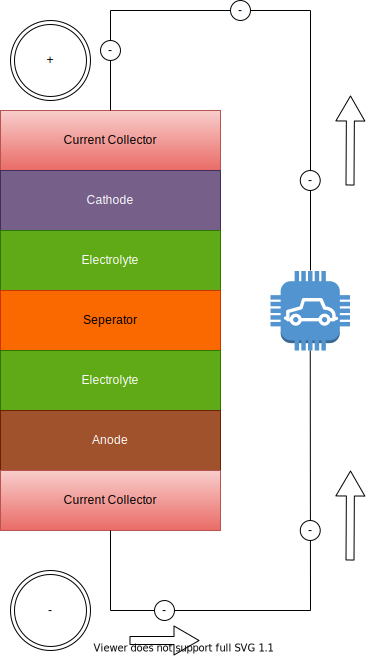

<!-- markdownlint-disable MD033 -->
Et litiumionbatteri består av to elektroder (anode og katode), separator, elektrolytt og to strømkollektorer (positive og negative).

Under utladning får en elektrokjemisk reaksjon i Anode den til å frigjøre positive litiumioner i elektrolytten.
Elektrolytten bærer de positivt ladede litiumionene fra anoden til katoden.

Denne reaksjonen i anode kalles reduksjon og anoden er kjent som reduksjonsmidlet fordi den mister litiumatomer.

Katoden er kjent som oksidasjonsmidlet fordi den aksepterer litiumioner fra anoden.

Når anoden frigjør positive litiumioner, frigjør den samtidig elektronene fra elektrodens litiumatomer.

Disse frie elektronene samles inne i anoden. Som et resultat har de to elektrodene forskjellige ladninger:

Anoden blir negativt ladet når elektroner frigjøres, og katoden blir positivt ladet når positive litiumioner forbrukes.

Denne forskjellen i ladning gjør at elektronene ønsker å bevege seg mot den positivt ladede katoden. Imidlertid har de ikke en måte å komme dit inne i batteriet fordi separatoren hindrer dem i å gjøre det. Ladningen måles i volt og avhenger av kjemien som brukes. En typisk litiumioncelle har en ladning mellom 3,6 - 4,2 volt avhengig av ladetilstanden (SOC).

I en EV kan vi dra nytte av ønsket om at elektronene skal gjenforenes med de positive litiumionene i katoden. Hvis vi
lage en ekstern krets gjennom en elektrisk motor eller en annen elektronisk komponent vi kan strømmen av elektroner drive motoren.

Strømkollektorene fungerer som en elektrisk leder mellom elektroden og eksterne kretser.

{}
