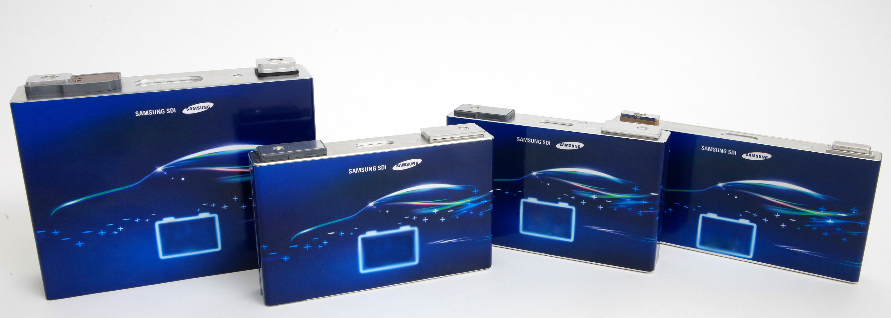

## Cell parts

### Anode

The anode material in vast majority of lithium-ion batteries are graphite powder.

Graphite materials are either synthetically-produced or mined from the ground, and then processed before being baked onto a copper foil to serve as anodes.

Graphite anodes meet the voltage requirements of most common Li-ion cathodes, are relatively affordable, extremely light, porous and durable.

### Cathode

There are multiple cathode materials to choose from within the Li-ion battery space.

Originally, the primary active component of the cathode was cobalt. To reduce the dependencies to cobolt different chemistries are used.

#### Lithium nickel manganese cobalt oxides (NMC)

[Lithium nickel manganese cobalt oxides](https://en.wikipedia.org/wiki/Lithium_nickel_manganese_cobalt_oxides) is the most common chemistry on EV's today.

The metal ratio varies. The versions was NMC 111, then NMC 622 was the common followed by NCM 711. Many vendors are working on providing cells with 811 metal ratio.

#### Lithium nickel cobalt aluminium oxides (NCA)

[Lithium nickel cobalt aluminium oxides](https://en.wikipedia.org/wiki/Lithium_nickel_cobalt_aluminium_oxides) (NCA) are used by Panasonic.

#### Lithium iron phosphate battery (LFP)

[Lithium iron phosphate battery](https://en.wikipedia.org/wiki/Lithium_iron_phosphate_battery)

### Seperator

A [separator](https://en.wikipedia.org/wiki/Separator_(electricity)) is a permeable membrane placed between a battery's anode and cathode. 

### Electrolyte

Liquid electrolytes in lithium-ion batteries consist of lithium salts in an organic solvent, such as ethylene carbonate, dimethyl carbonate, and diethyl carbonate.

A liquid electrolyte acts as a conductive pathway for the movement of cations passing from the negative to the positive electrodes during discharge and the opoosite 
direction when charging.

Electrolytes based on solid materials are areas that many works on. These are called [solid state batteries](https://en.wikipedia.org/wiki/Solid-state_battery). Currently there is no concrete plans of any mass production EV with Solid state batteries. 

### Current collector

 The current collector is used to provide conduction of electrons from inside the electrochemical reaction to the external part without any reaction within the operation window.

 Currently used collectors are mostly made of aluminum or copper foils.

## Cell Housing

The most common housing

### Pouch

### Prismatic

### Cylinder

## Audi cells

### LG Chem LGX N2.1

This cell type is used on Audi e-tron 55 and Audi e-tron S.
|**Spec** | **Value** |
|-----|------|
| Manufacturer | LG Chem |
| Model | LGX N2.1 |
| Nominal Capacity |60 Ah |
| Nominal Voltage | 3,666666 V |
| Nominal energy | 219,907 Wh |
| Thickness|  16,5 mm |
| Width | 100 mm |
| Height | 330 mm |
| Volume | 0,544500 |
| Weight | 820 g |
| Volumetric Energy Density | 403 Wh/L |
| Gravimetric Energy Density | 268 Wh/kg |
| Chemistry | [NCM 622](https://en.wikipedia.org/wiki/Lithium-ion_battery) |

### LG Chem LGX E78

This cell type is used on Audi Q4 e-tron.

| **Spec** |  **value** |
|-----|-----|
| Manufacturer |  LG Chem |
| Model | LGX E78 |
| Nominal Capacity | 78 Ah |
| Nominal Voltage | 3,65 V |
| Weight | 1.073 g |
| Gravimetric energy density | 265 Wh/kg |
| Chemistry | NCM 712 |

### LG Chem E66A

This cell type is used on Audi e-tron GT and Audi RS e-tron GT

|**Spec** | **Value** |
|-----|------|
| Manufacturer | LG Chem |
| Model | E66A |
| Nominal Capacity |64.6 Ah |
| Minimum Capacity | 63,5 Ah |
| Nominal Voltage | 3,651515 V |
| Nominal energy | 235,888 Wh |
| Minimum energy| 232,2 Wh |
| Thickness|  11,7 mm |
| Width | 104 mm |
| Height | 350 mm |
| Volume | 0,425880 |
| Weight | 897 g |
| Volumetric Energy Density | 553 Wh/L |
| Gravimetric Energy Density | 263 Wh/kg |
| Chemistry | [NCM 712](https://en.wikipedia.org/wiki/Lithium-ion_battery) |

{}
