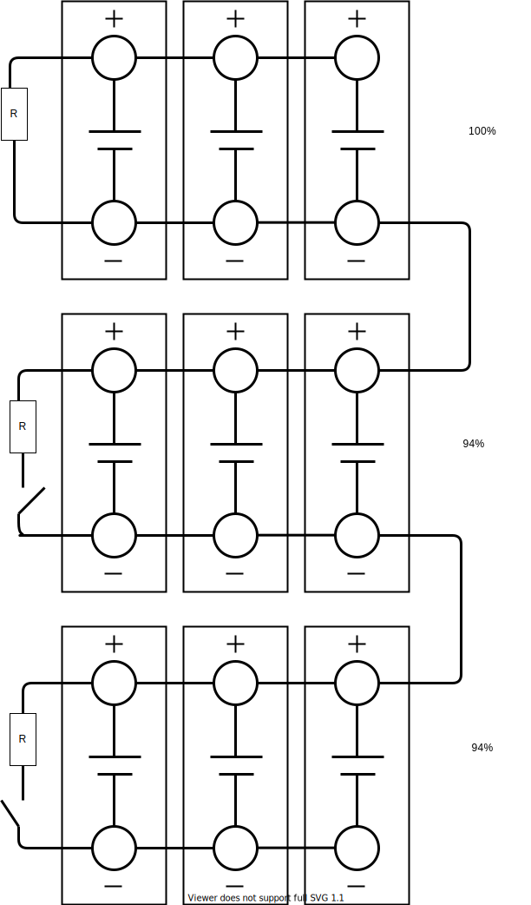

<!-- markdownlint-disable MD033 -->
Zellausgleich ist erforderlich, wenn eine Gruppe von Zellen einen höheren oder niedrigeren SOC als andere Gruppen von Zellen hat.

In diesem Beispiel ist die obere Gruppe von Zellen zu 100% geladen und der Ladevorgang ist abgeschlossen, jedoch beträgt der Ladezustand der Hochvoltbatterie nur noch 96 %. Durch Auswuchten wird diese Zelle nun über einen Widerstand entladen und kann dadurch solange weiter geladen werden, bis alle Zellen den gleichen Ladezustand erreicht haben, wodurch die Hochvoltbatterie ihre maximale Kapazität erreichen kann.

Hierzu vergleicht die Batterieregelungssteuereinheit die Spannungen der Zellgruppen. Wenn Zellengruppen eine hohe Zellspannung aufweisen, erhält die zuständige Batteriemodulsteuereinheit die Abgleichinformation. Der Abgleich erfolgt bei Spannungsdifferenzen größer als ca. 1 % beim Laden der Hochvoltbatterie. Nach dem Abschalten der Zündung überprüft die Batterieregelungssteuereinheit, ob ein Abgleich notwendig ist, und löst diesen gegebenenfalls aus. Typischerweise wird bei Ladeständen größer als 30 % durchgeführt.

Bei rein elektrischen Audis ist es nicht möglich, die Zellbilanz ohne zusätzliche Werkzeuge zu überprüfen. ODBEleven ist eines dieser Werkzeuge, die verwendet werden können. Der folgende Screenshot zeigt, dass ein Zellensatz 10% SOC und ein anderer 13% soc hat. Audi e-tron hat 108 Zellensätze mit 3 oder 4 Zellen parallel je nach Version.

<figure>
    
    <figcaption><h4>Cell-Info von OBDEleven</h4></figcaption>
</figure>
