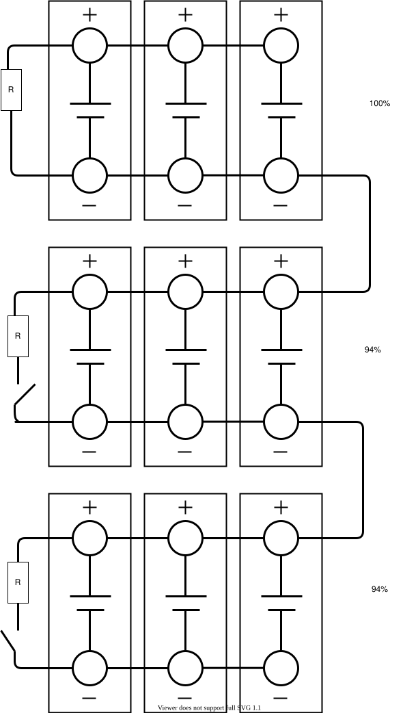

<!-- markdownlint-disable MD033 -->
L'équilibre cellulaire est nécessaire lorsqu'un groupe de cellules a une COS supérieure ou inférieure à celle d'autres groupes de cellules.

Dans cet exemple, le groupe supérieur de cellules est chargé à 100% et la procédure de charge est terminée. Cependant, le niveau de charge de la batterie haute tension est seulement 96 %. L'équilibrage signifie que cette cellule est maintenant déchargée via une résistance et peut ainsi continuer à être chargée jusqu'à ce que toutes les cellules aient atteint le même niveau de charge.

Pour ce faire, l'unité de régulation de la batterie compare les tensions des groupes cellulaires. Si les groupes cellulaires ont une tension de cellule élevée, l'unité de régulation des modules de batterie responsable reçoit les informations d'équilibrage. L'équilibrage est effectué lorsque des différences de tension supérieures à 1% se produisent lorsque la batterie haute tension est chargée. Après l'allumage, l'unité de régulation de la batterie vérifie si l'équilibrage est nécessaire et le déclenche si nécessaire.

Sur les Audi tout électrique, il n'est pas possible de vérifier l'équilibre cellulaire sans outils supplémentaires. ODBEleven est l'un de ces outils qui peut être utilisé. La capture d'écran suivante montre qu'un ensemble de cellules a 10% SOC et un autre 13% soc. Audi e-tron a 108 ensembles de cellules avec 3 ou 4 cellules en parallèle selon la version.

<figure>
    
    <figcaption><h4>Informations sur les cellules d'OBDELEven</h4></figcaption>
</figure>
