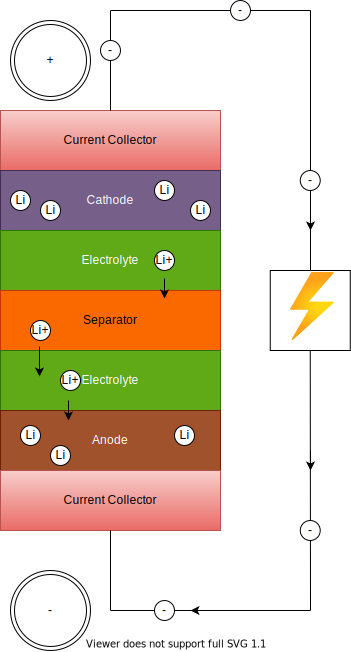

<!-- markdownlint-disable MD033 -->
Während des Ladens legt eine externe elektrische Stromquelle (die Ladeschaltung) eine Überspannung an, die einen Ladestrom zwingt, innerhalb der Batterie von der positiven zur negativen Elektrode zu fließen, d.h. in umgekehrter Richtung eines Entladestroms unter normalen Bedingungen, und die Lithiumionen wandern dann von der Kathode zur Anode, wo sie sich in einem als Interkalation bekannten Prozess in das poröse Elektrodenmaterial einbetten.


