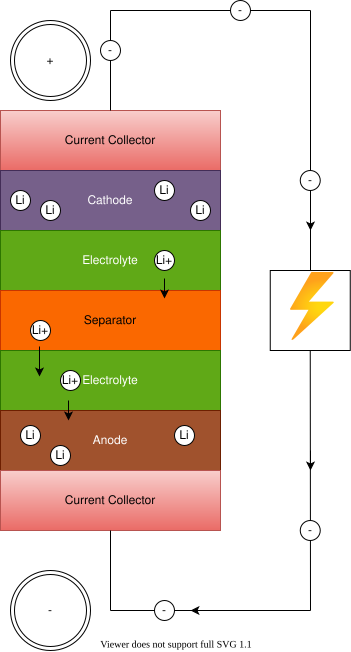

<!-- markdownlint-disable MD033 -->
Pendant la charge, une source d'énergie électrique externe (le circuit de charge) applique une surtension, forçant un courant de charge à s'écouler à l'intérieur de la batterie de l'électrode positive à l'électrode négative, c'est-à-dire dans la direction inverse d'un courant de décharge dans des conditions normales.


