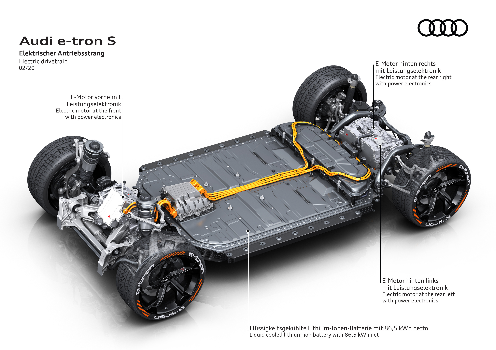

I tillegg jobber de med den nye SSP-plattformen som skal brukes på modeller fra 2025.

Nedenfor finner du detaljer om de forskjellige plattformene.

## MLB EVO

Audi e-tron er basert på en omfattende tilpasset variant av den modulære langsgående plattformen (MLB evo). MLB Evo-plattformen er en delt plattform som inkluderte ICE som Lamborghini URUS og Audi A8. Men for e-tron bygget Audi et helt nytt dedikert chassis og karosseri for e-tron

[Les mer om MLB-EVO-plattformen](mlb-evo)

## J1 ytelsesplattform

J1 Performance-plattformen er utviklet sammen med Porsche og brukes til Audi e-tron GT og Audi RS e-tron GT.

[Finn ut mer om J1-ytelsesplattformen](j1-performance)

## Modular Electrification Toolkit (MEB)

Hva det modulære transversale verktøysettet (MQB) er for modellutvalget med forbrenningsmotorer, vil det modulære elektrifiseringsverktøysettet (MEB) være for de helelektriske Audi-modellene. Den brukes til de mindre Audi-modellene som Audi Q4 e-tron og Audi Q5 e-tron.

[Finn ut mer om MEB](meb)

## PPE (Premium Platform Electric)

For sine fullstørrelsesklasse- og luksusmodeller er Audi avhengig av en fjerde plattform. Audi Q6 e-tron og Audi A6 e-tron vil bli bygget på denne plattformen.

[Finn ut mer om PPE](ppe/drivetrain.jpg)

## SSP (Scalable Systems Platform)

Innen 2026 vil Volkswagen Group samle sine fremtidige teknologier på Scalable Systems Platform (SSP). Etter det modulære elektriske drivsettet (MEB) og Premium Platform Electric (PPE), representerer SSP neste generasjon av helelektrisk, heldigital og svært skalerbar mekatronikkplattform.

[Finn ut mer om SSP](ssp)

## Videopresentasjon

Du kan også se videoen nedenfor


