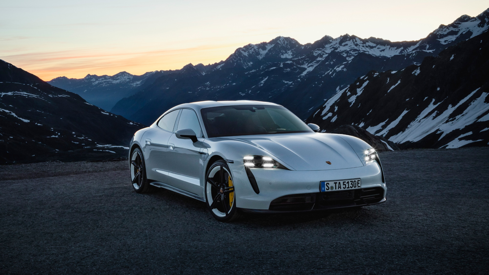

[Audi e-tron GT](../../../models/e-tron-gt) had world premiere in april 2021 and comes in two version based on the J1 performance platform.
The Audi e-tron GT is equipped with two permanently excited synchronous machines (PSM) that output a system performance of 530 metric hp (390 kW) and 640 Nm
(472 lb-ft) of torque.  While Audi RS e-tron GT output a system performance of 645 metric hp (475 kW) and 830 Nm (612.2 lb-ft) of torque.

The four-door Audi RS e-tron GT is propelled from zero to 100 km/h (62.1 mph) in 3.3 seconds and reaches 200 km/h (124.3 mph) in just over 12 seconds, before propulsion 
ends at 250 km/h (155.3 mph).

If necessary, the Audi e-tron GT can be charged in a short space of time. The high-voltage system in J1-performance platform is designed for a voltage of 800 volts and allows the battery to be charged to 80 percent in 22.5 minutes at a DC terminal with an output of 350 kW.

In accordance with the WLTP standard, the Audi e-tron GT achieves a range of 472 kilometers (293.5 mi) on one battery charge.

The battery, which has an energy content of more than 90 kWh, is located in the underbody, between the axles. The battery package is designed with recesses in the rear footwell. This provides a high level of seating comfort for all occupants. This special layout allows the drive battery to be integrated in the vehicle floor despite the low body position that is typical for sports cars, thereby creating a very low vehicle center of gravity. At the same time, this creates comfortable seating ergonomics.

Its lightweight design body and the optional roof made of carbon fiber-reinforced polymer (CFRP) are
built according to the principle of multi-material construction. At 4.989 meters (16.3 ft) long,
1.96 meters (6.4 ft) wide and 1.41 meters (4.5 ft) tall, the  Audi e-tron GT has the proportions of a typical Gran Turismo.

In combination with the low center of gravity, the quattro drive, which is equipped with an electric motor at the front and rear axles, offers ideal conditions for a sports car.

The drive management distributes the torques of the electric motors between the axles as needed and also regulates the wheels separately.

The technology layout on J1-performance platform allows for numerous suspension and performance features, for example all-wheel steering or a sport differential, providing excellent traction and a high level of vehicle dynamics.

{}
