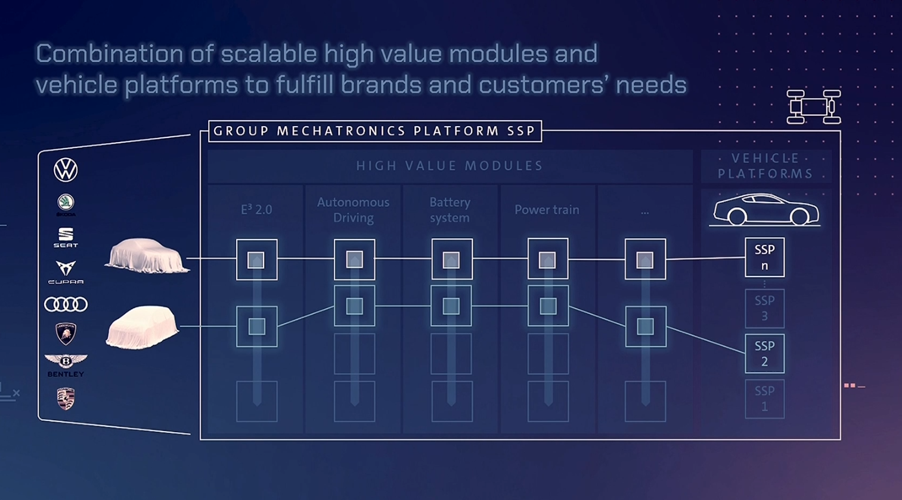

<!-- markdownlint-disable MD033 -->

In the future, it will be possible to build models from all brands and segments on the SSP – more than 40 million Group cars throughout its life cycle.

With the SSP, the Volkswagen Group can rapidly and efficiently provide its customers with innovative functions in their cars, across all brands. This makes the SSP key to autonomous driving. At the same time, considerable economies of scale are achieved, whilst also reducing complexity and development costs.

By combining different modules with various sizes of platform, the Group’s brands also have a host of opportunities to differentiate themselves. From 2025, Audi’s Artemis project will use significant SSP modules for the first time. In 2026, Volkswagen will introduce this technology to the high-volume segment with its first model based on the SSP – the “Trinity” project.

The first models from Audi on this platform is expected to by

- Audi A8 e-tron (2025) (Artemis project)
- Audi Q8 e-tron (2026) (Apollon project)

## Configuration

With SSP the car models can be configured in different setups. 

## Battery

The SSP platform will introudce the unified cell technology. 

## SSP Presentation

[See Audi Chairman Markus Duesmann talk about SSP](https://comsatmedia.s3.eu-west-1.amazonaws.com/vw/vwnewsroom/2021-07-13_strategy_day/vw_210713_strategyday_speech_duesmann_en.mp4)

{}
